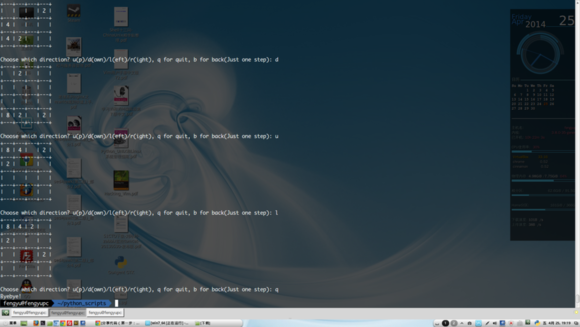
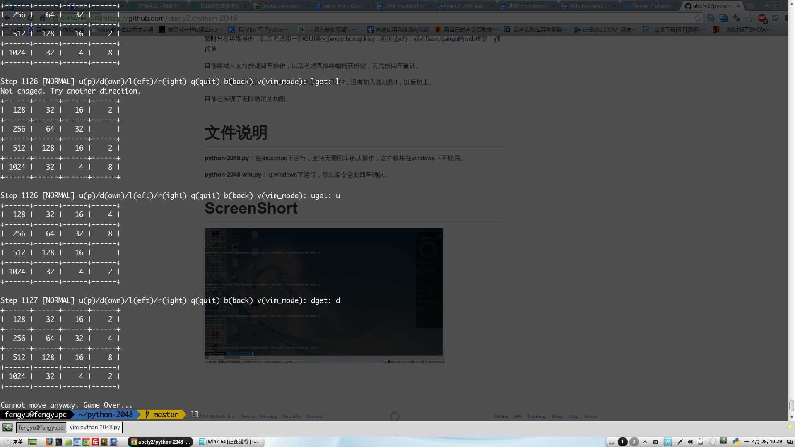

python-2048
===========

2048小游戏的python简单实现。

暂时只有终端界面
目前终端只支持按键回车操作，以后考虑直接终端捕获按键，无需按回车确认。

另外，规则也不完善，比如每次新插入的数字只有2，没有加入随机数4，以后加上。

文件说明
===

**python-2048.py**：在linux/mac下运行，支持无需回车确认操作，这个模块在windows下不能用。

**python-2048-win.py**：在windows下运行，每次指令需要回车确认。

ScreenShort
===

